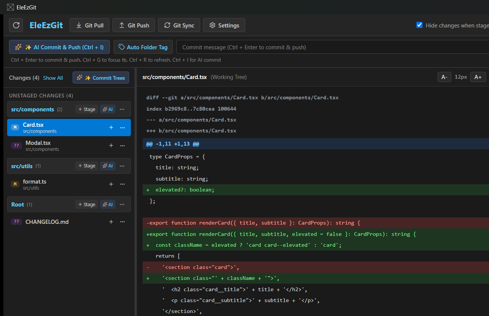

# EleEzGit

<p align="center">
  <strong>Fast, Lightweight Git Diff Viewer &amp; AI Commit Assistant built with Electron, React &amp; TypeScript</strong>
</p>

<p align="center">
  
  
  
  
  
  <a href="https://github.com/uponatime2019/EleEzGit/releases/latest">
    
  </a>
</p>

---

## ⚡ Try It Now / Download

Get up and running immediately — **no complex installation required**!

📥 **[Download Latest Release Packages](https://github.com/uponatime2019/EleEzGit/releases/latest)**

- **Windows**: Download `EleEzGit-v*-win-x64.zip`, extract to any folder, and run `EleEzGit.exe`.
- **macOS**: Download `.dmg` (or `.zip`) for your architecture:
  - Apple Silicon (M1/M2/M3/M4): `EleEzGit-*-mac-arm64.dmg`
  - Intel Macs: `EleEzGit-*-mac-x64.dmg`
- **Linux**: Download `EleEzGit-*-linux-x64.AppImage` (make executable with `chmod +x` and run), `.deb` for Ubuntu/Debian, or `.tar.gz`.

---

## 📸 Screenshot



---

## ⚡ Overview

**EleEzGit** is an Electron conversion of [EzGit](https://github.com/uponatime2019/EzGit). It brings the same powerful Git workflow assistance — AI commit generation, visual diff viewing, one-click staging — in a cross-platform Electron + React + TypeScript stack.

---

## 🚀 Key Features

### 🤖 AI-Powered Commit Message Generation
- **OpenAI-Compatible Providers**: Seamlessly connects to DeepSeek, OpenAI, Groq, Ollama, OpenRouter, and any standard `/v1/chat/completions` endpoint.
- **Context-Aware Smart Prefixing**: Automatically detects the primary modified folder and structures commit prefixes (e.g. `[Services\GitService] ...`), with options for custom prefixes or clean single-line summaries.
- **Instant AI Commit &amp; Push**: Trigger instant diff analysis, commit message generation, commit, and push with a single shortcut (<kbd>Ctrl</kbd> + <kbd>I</kbd>).
- **Sequential Tree AI Commits**: Commit entire folder hierarchies independently with automatically synthesized messages.

### 🔍 Visual Git Diff &amp; Change Explorer
- **Folder Tree Depth Grouping**: Dynamically group changed files by directory depth (depth 1, 2, 3...) for effortless review in large mono-repos or multi-module projects.
- **Syntax-Aware Viewer**: View granular additions and removals with customizable monospaced typography (Cascadia Code, Consolas, JetBrains Mono, Fira Code, and more) and interactive zoom (<kbd>A-</kbd> / <kbd>A+</kbd>).
- **Image &amp; Asset Inspection**: Embedded side-by-side Before/After preview for image files (`.png`, `.jpg`, `.svg`, `.ico`, `.webp`) and warnings for oversized non-code files (&gt; 800 KB).
- **Single Diff Mode**: Option to display unified diff view alongside changes.

### ⚡ One-Click Git Operations
- **Git Pull &amp; Git Push**: Dedicated quick-action buttons with real-time status banners.
- **Git Sync**: Automatic pull with merge verification followed by push in a single workflow.
- **Batch &amp; Granular Staging**: "Stage All" for directory groups or stage, discard, and reset individual modified and untracked files.
- **Quick `.gitignore` Action**: Add untracked files directly to `.gitignore` from the context menu.

### 🛠️ Conflict &amp; Troubleshooting Assistant
- **Automated Conflict Recovery**: Detects push rejections due to remote updates and offers automated pull retry.
- **Index Lock Healing**: Automatic detection and retry for stale `.git/index.lock` contention.

### 📜 Recent Commits &amp; History
- **Interactive History Browser**: Explore recent commits with pagination, commit hash copying, formatted timestamps, and author tags.
- **Commit Inspection Mode**: Click on any commit to view changed files and per-file diffs for that revision.

### 🎨 Modern Dark UI
- **Fluent-Inspired Design**: Dark theme with Fluent CSS variable system and smooth hover states.
- **Dynamic Theme Switching**: Toggle between Light, Dark, or System theme.
- **Single-Instance Restoration**: Intelligently restores and brings the existing window to the foreground if launched again.

---

## ⌨️ Keyboard Shortcuts Reference

| Shortcut | Action |
|:---|:---|
| <kbd>Ctrl</kbd> + <kbd>Enter</kbd> | Commit changes &amp; Push to remote |
| <kbd>Ctrl</kbd> + <kbd>I</kbd> | AI Commit &amp; Push (analyze diff &amp; generate message) |
| <kbd>Ctrl</kbd> + <kbd>G</kbd> | Jump focus to the Commit Message input box |
| <kbd>Ctrl</kbd> + <kbd>R</kbd> | Refresh Git repository status |
| <kbd>F5</kbd> | Refresh Git repository status |
| <kbd>Ctrl</kbd> + <kbd>P</kbd> | Trigger Git Push |
| <kbd>Ctrl</kbd> + <kbd>U</kbd> | Trigger Git Pull |

---

## 🛠️ Getting Started / Development

### Prerequisites
- [Node.js](https://nodejs.org/) (v18+)
- Git command line tools installed and accessible on your `PATH`

### Install Dependencies
```bash
npm install
```

### Run in Development
```bash
npm run dev
```

### Build for Production
```bash
npm run build
```

### Package Standalone Portable Executable
```bash
npm run dist
```

---

## 🏗️ Architecture &amp; Technology Stack

```
EleEzGit/
├── assets/                  — Application icons and images
├── electron/
│   ├── main.ts              — Electron main process, window lifecycle, IPC handlers
│   ├── preload.ts           — Secure contextBridge exposing typed ElectronAPI
│   ├── gitService.ts        — Git CLI process execution, status parser, image diffs
│   ├── aiService.ts         — Diff compacting, OpenAI API client, prefix formatter
│   └── settingsStore.ts     — File-based settings store (compatible with EzGit)
├── src/
│   ├── components/          — React components (Header, CommitBar, FileList, DiffViewer, etc.)
│   ├── context/             — AppContext state manager
│   ├── styles/              — Tailwind CSS & custom Fluent theme
│   ├── types/               — Shared TypeScript definitions
│   └── App.tsx              — Root application layout
├── package.json
└── vite.config.ts
```

### Core Technologies
- **Runtime**: [Electron](https://www.electronjs.org/) 34.x (Chromium + Node.js)
- **UI Framework**: [React](https://react.dev/) 19
- **Build Tool**: [Vite](https://vitejs.dev/) 6.x with esbuild for Electron main/preload
- **Styling**: [Tailwind CSS](https://tailwindcss.com/) 4.x + custom Fluent Design variables
- **Language**: TypeScript (strict mode, ESM renderer + CJS main process)
- **Packaging**: [electron-builder](https://www.electron.build/) — NSIS installer + portable zip

---

## 🗺️ Roadmap

- [x] Electron + React 19 + TypeScript + Vite conversion of EzGit
- [x] OpenAI-compatible AI commit message generation (DeepSeek, OpenAI, Groq, Ollama)
- [x] Dynamic tree-depth file grouping and batch staging
- [x] Configurable syntax font and side-by-side / unified diff viewer
- [x] Automatic smart folder tagging and custom commit prefixes
- [x] Image diff preview (Before / After side-by-side)
- [ ] Interactive hunk-by-hunk diff staging &amp; discarding
- [ ] Side-by-side visual merge conflict resolution tool
- [ ] Multi-branch switcher and remote management pane
- [ ] Git stash list, preview, and pop interface
- [ ] Git log graphical branch topology tree
- [x] Cross-platform builds (Windows, macOS, Linux)

---

## 🤝 Contributing &amp; Community Welcome

Contributions make the open-source community an inspiring place to learn, create, and build together. Any contributions you make are **greatly appreciated**!

- 🐛 **Report Bugs**: Found an issue? Open a bug report with details and reproduction steps.
- 💡 **Suggest Features**: Have ideas to make EleEzGit even better? Submit a feature proposal.
- 🔧 **Submit Pull Requests**: Fork the repository, create a branch, and open a PR.
- 🌟 **Star the Repository**: If you find EleEzGit helpful, give it a star on GitHub!

---

## 📄 License

This project is licensed under the **MIT License** — see the [LICENSE](LICENSE) file for details.
